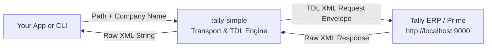

# Tally Simple

[](https://www.npmjs.com/package/tally-simple)
[](LICENSE)
[](package.json)
[](package.json)

**A typed JavaScript client and CLI for querying business data from Tally via TDL definitions.**

Query Tally using declarative endpoint paths, supply a company name, and receive Tally's exact, raw XML response.

**[Documentation Hub](https://keshavsoft.github.io/tally-simple/)** · **[View on npm](https://www.npmjs.com/package/tally-simple)**

---

## 📖 The Story of Tally Simple

Tally ERP and Tally Prime expose an HTTP XML/ODBC interface (defaulting to `http://localhost:9000`), but speaking to it directly is notoriously complex:
- Requests require heavy, boilerplate `<ENVELOPE>` XML wrappers.
- Field extraction depends on specific, case-sensitive TDL (Tally Definition Language) collection queries.
- Developers often end up copy-pasting raw XML string templates throughout their applications.

### The Purpose of `tally-simple`
`tally-simple` solves this by serving as the **pure transport and query execution engine** for Tally:
1. It encapsulates complex TDL collection definitions declaratively inside the library.
2. It provides an intuitive, autocomplete-friendly JavaScript API and matching CLI commands.
3. It deliberately returns **pure raw XML strings** from Tally.

### Why Raw XML?
Keeping the response as raw XML follows the **UNIX philosophy**:
- **Zero Loss**: No information or attributes are lost or warped by premature JSON conversion.
- **Pipeable & Inspectable**: Output can be redirected directly to files (`> units.xml`) or formatted with standard XML tools (`| xmllint`).
- **Downstream Decoupling**: Downstream layers (such as `tally-simple-json` or custom parsers) can parse and shape the XML as needed, without coupling transport to data formatting.



---

## ⚡ Quick Start

### Installation

```bash
npm install tally-simple
```

*Requires Node.js 20.10+ and a running Tally instance with XML server enabled on `http://localhost:9000`.*

---

## 💻 JavaScript Usage (ESM)

Import the default `tally` client and call any query path by passing the company name:

```javascript
import tally from "tally-simple";

// Fetch units of measurement
const unitsXml = await tally.masters.units.fetch("Mani9");
console.log(unitsXml);

// Fetch stock items with batch allocations
const stockXml = await tally.masters.stockItems.withBatches("Mani9");

// Fetch ledgers with GST registration details
const ledgersXml = await tally.masters.ledgers.withGstDetails("Mani9");

// Fetch stock groups with parent hierarchies
const groupsXml = await tally.masters.stockGroup.withParent("Mani9");
```

Each query returns a `Promise<string>` resolving to Tally's complete raw XML response body.

---

## ⌨️ Command Line Interface (CLI)

Run any query directly from your terminal using `npx`:

```bash
# Query units
npx tally-simple masters.units.fetch --company Mani9

# Or include the 'tally.' root prefix
npx tally-simple tally.masters.stockItems.withBatches --company Mani9
```

### Piping and Saving Output

Because the response is written directly to `stdout`, you can seamlessly pipe or save the raw XML:

```bash
# Save to file
npx tally-simple masters.units.fetch --company Mani9 > units.xml

# Format output using xmllint
npx tally-simple masters.ledgers.withGstDetails --company Mani9 | xmllint --format -
```

---

## 📋 Available Queries

All queries target master records and return Tally's native export collection XML:

| Query Path | Target Domain | TDL Collection Query | What it returns |
| :--- | :--- | :--- | :--- |
| `masters.units.fetch` | Unit | `<TYPE>Unit</TYPE><FETCH>$$Alias:Name</FETCH>` | Units of measurement and aliases |
| `masters.stockItems.withBatches` | StockItem | `<TYPE>StockItem</TYPE><FETCH>BaseUnits</FETCH><FETCH>BatchAllocations.*</FETCH>` | Stock items, base units, and batch allocations |
| `masters.ledgers.withGstDetails` | Ledger | `<TYPE>Ledger</TYPE><FETCH>LEDGSTREGDETAILS.LIST</FETCH>` | Accounting ledgers and GST details |
| `masters.stockGroup.withParent` | StockGroup | `<TYPE>StockGroup</TYPE><FETCH>Parent</FETCH>` | Stock groups and parent hierarchy |

---

## 🧠 System Architecture

`tally-simple` is built on a clean, declarative 3-layer architecture:

```text
┌─────────────────────────────────────────────────────────────┐
│                   1. Declarative Specifications             │
│                                                             │
│   src/v7/api.json                 src/v7/source.json        │
│   (Public Route Allowlist)        (TDL Definition Tree)     │
└──────────────────────────────┬──────────────────────────────┘
                               │
                               ▼
┌─────────────────────────────────────────────────────────────┐
│                   2. Public Composition Root                │
│                                                             │
│   src/v7/index.js                                           │
│   (Binds Specifications to Engines via Dependency Injection)│
└──────────────────────────────┬──────────────────────────────┘
                               │
                               ▼
┌─────────────────────────────────────────────────────────────┐
│                   3. Internal Working Engines               │
│                                                             │
│   internal-working/route/         internal-working/execution│
│   (Builds Callable Object Tree)   (4-Step Request Pipeline) │
└─────────────────────────────────────────────────────────────┘
```

### The 4-Step Execution Pipeline

When any query method is called (e.g. `tally.masters.units.fetch("Mani9")`), execution flows through 4 focused steps:

1. **`validateCompany`**: Ensures the company name is a non-empty string and trims whitespace.
2. **`getTdl`**: Fast $O(1)$ reduction lookup into `source.json` to extract the corresponding TDL definition.
3. **`buildXmlBody`**: Safely escapes XML special characters and injects the company and TDL into the `<ENVELOPE>` request template.
4. **`postHttp`**: Sends an HTTP POST request to `http://localhost:9000` with `Content-Type: text/xml` and returns the raw response body.

---

## 📚 Documentation Guides

Explore the detailed architecture and usage guides:

- **[Documentation Hub](https://keshavsoft.github.io/tally-simple/)**: The interactive documentation portal.
- **[System Architecture](docs/architecture.md)**: Deep dive into the declarative design and layers.
- **[Execution Pipeline](docs/execution-pipeline.md)**: Step-by-step walkthrough of the 4-stage request flow.
- **[Route Assembly Engine](docs/route-engine.md)**: How the callable JavaScript tree is synthesized from `api.json`.
- **[Available Queries Reference](docs/queries.md)**: Complete TDL definitions and XML structures.
- **[Usage Guide](docs/usage.md)**: Advanced options, CLI piping, and TypeScript integration.

---

## 📄 License

MIT © [KeshavSoft](https://github.com/keshavsoft)
